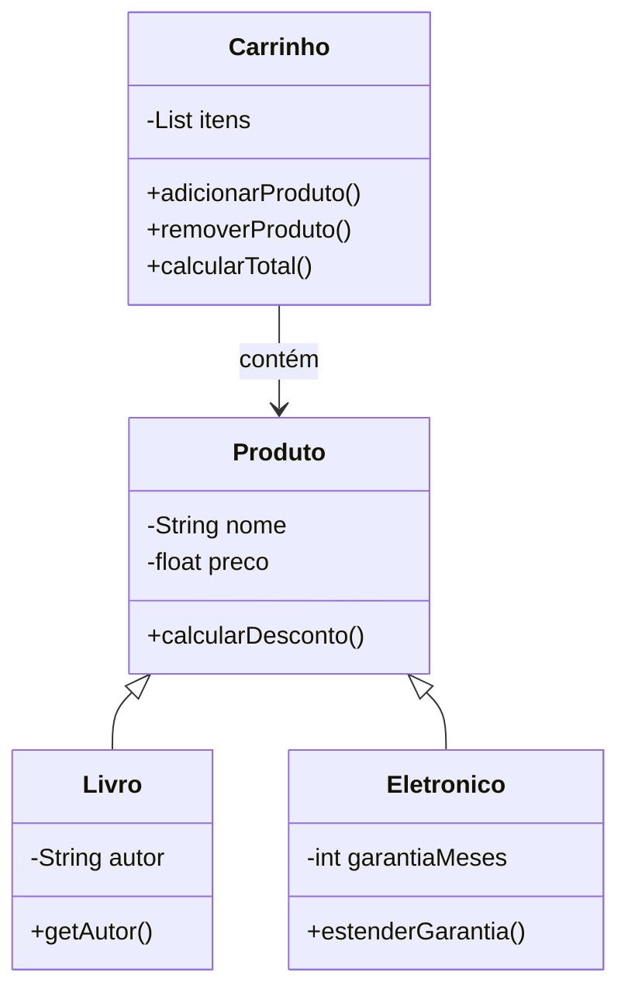
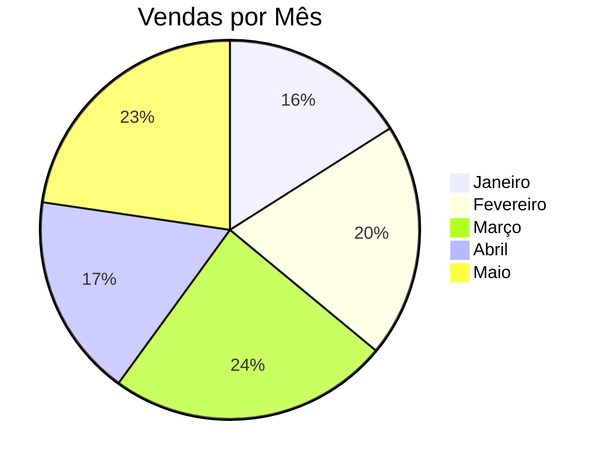

```mermaid
classDiagram
    class Produto {
        -String nome
        -float preco
        +calcularDesconto()
    }

    class Livro {
        -String autor
        +getAutor()
    }

    class Eletronico {
        -int garantiaMeses
        +estenderGarantia()
    }

    class Carrinho {
        -List<Produto> itens
        +adicionarProduto()
        +removerProduto()
        +calcularTotal()
    }

    Produto <|-- Livro
    Produto <|-- Eletronico
    Carrinho --> Produto : contém
```

```mermaid
pie title Vendas por Mês
  "Janeiro" : 12000
  "Fevereiro" : 15000
  "Março" : 18000
  "Abril" : 13000
  "Maio" : 17000
```
